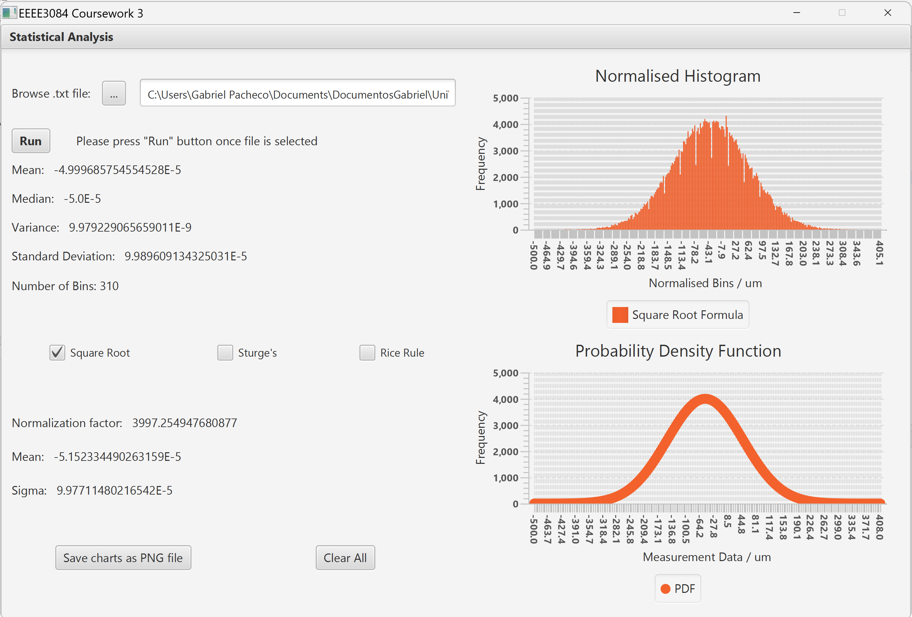
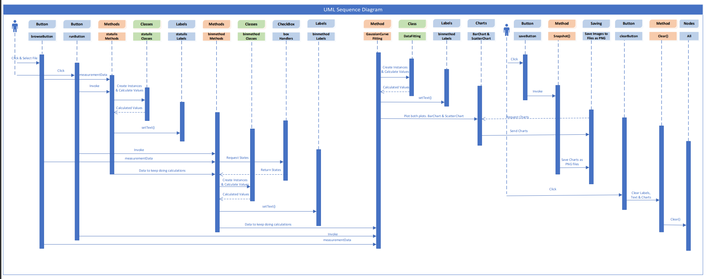

# JAVA---DataAnalysis
JAVA program developed as part of a coursework in University.

User-friendly interface which performs a statistical analysis on a set of data provided to it through a text file. 

## Description
Based on the data provided the program will display:
- A **normalised histogram** of the data.
- A **probability density function** of the data.
- The following **statistical properties**:
  + Mean
  + Median
  + Variance
  + Standard deviation
  + Number of bins (depending on the method selected between Square root, Sturge's, and Rice rule)
  + Normalisation factor
  + Normalised mean
  + Sigma

## Folders and files
* **binmethod:** Implementation of Square root, Sturge's and Rice rule formulae.
* **coursework3:** Package that contains the main for the GUI.
* **mathutils:** Package which contains a class that can perform data fitting.
* **statutils:** Package which has the capability to calculate the statistical figures of the data samples.
* **testUnits:** Package which contains files that can be used to test binmethod, mathutils, and statutils.
* **measurementData:** Text file which can be used to test that the application works.

## Images
GUI for the application:

UML Sequence Diagram of how the whole program works:

